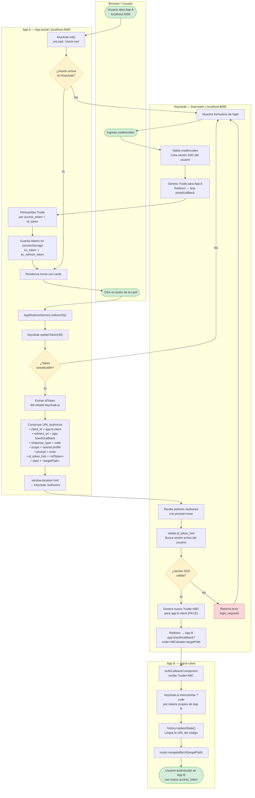

# Diagrama de Flujo: SSO Keycloak — Redirección entre App A y App B

Flujo completo de autenticación con Keycloak y redirección silenciosa entre dos clientes
(`bnp-portal` y `app-b-client`) registrados en el mismo realm **`bnp-realm`**,
usando `id_token_hint` con `prompt=none` para evitar una segunda pantalla de login.

---

---

## Parámetros clave en la URL `/authorize`

| Parámetro | Valor | Propósito |
|---|---|---|
| `client_id` | `app-b-client` | Identifica al cliente destino en Keycloak |
| `redirect_uri` | `https://app-b.com/auth/callback` | Debe estar registrado como _Valid Redirect URI_ en App B |
| `response_type` | `code` | Authorization Code Flow con PKCE |
| `scope` | `openid profile` | Scopes solicitados para el nuevo token de App B |
| `prompt` | `none` | Prohíbe mostrar pantalla de login; falla con `login_required` si no hay sesión activa |
| `id_token_hint` | `<id_token de App A>` | Identifica al usuario autenticado; habilita SSO silencioso entre clientes del mismo realm |
| `state` | `<targetPath codificado>` | Preserva la ruta destino en App B para restaurarla tras el callback |

---

## Referencias

- [SSO_REDIRECT.md](SSO_REDIRECT.md) — Guía de implementación paso a paso con código
- [src/environments/environment.ts](src/environments/environment.ts) — Configuración del realm y cliente
- [src/app/app.config.ts](src/app/app.config.ts) — Inicialización de Keycloak con `onLoad: 'check-sso'`
- [src/shared/guards/auth.guard.ts](src/shared/guards/auth.guard.ts) — Guard que protege rutas de App A
