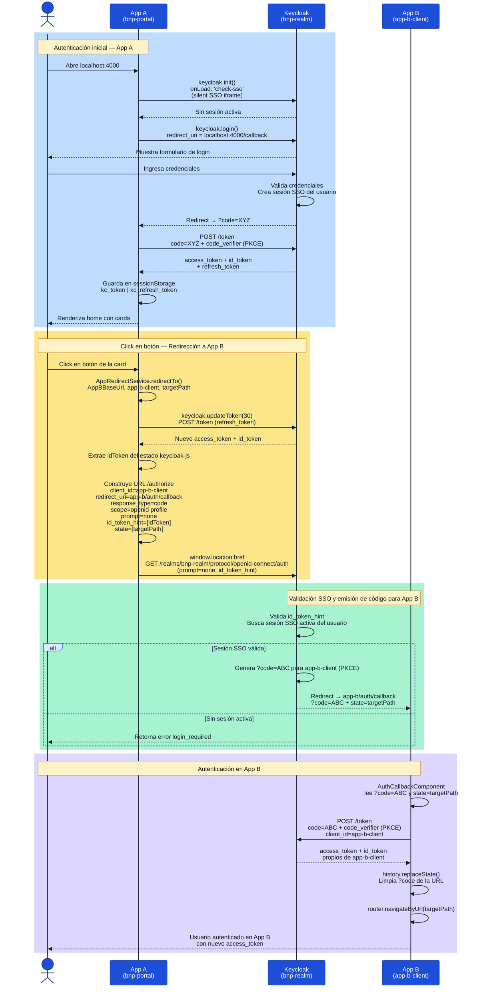

# Diagrama de Secuencia: SSO Keycloak — Redirección entre App A y App B

Flujo de autenticación con Keycloak y redirección silenciosa entre dos clientes
(`bnp-portal` y `app-b-client`) registrados en el mismo realm **`bnp-realm`**,
usando `id_token_hint` con `prompt=none` para evitar una segunda pantalla de login.

---

---

## Referencias

- [SSO_REDIRECT.md](SSO_REDIRECT.md) — Guía de implementación paso a paso con código
- [SSO_REDIRECT_FLOW.md](SSO_REDIRECT_FLOW.md) — Diagrama de flujo (flowchart) del mismo proceso
- [src/environments/environment.ts](src/environments/environment.ts) — Configuración del realm y cliente
- [src/app/app.config.ts](src/app/app.config.ts) — Inicialización de Keycloak con `onLoad: 'check-sso'`
- [src/shared/guards/auth.guard.ts](src/shared/guards/auth.guard.ts) — Guard que protege rutas de App A
